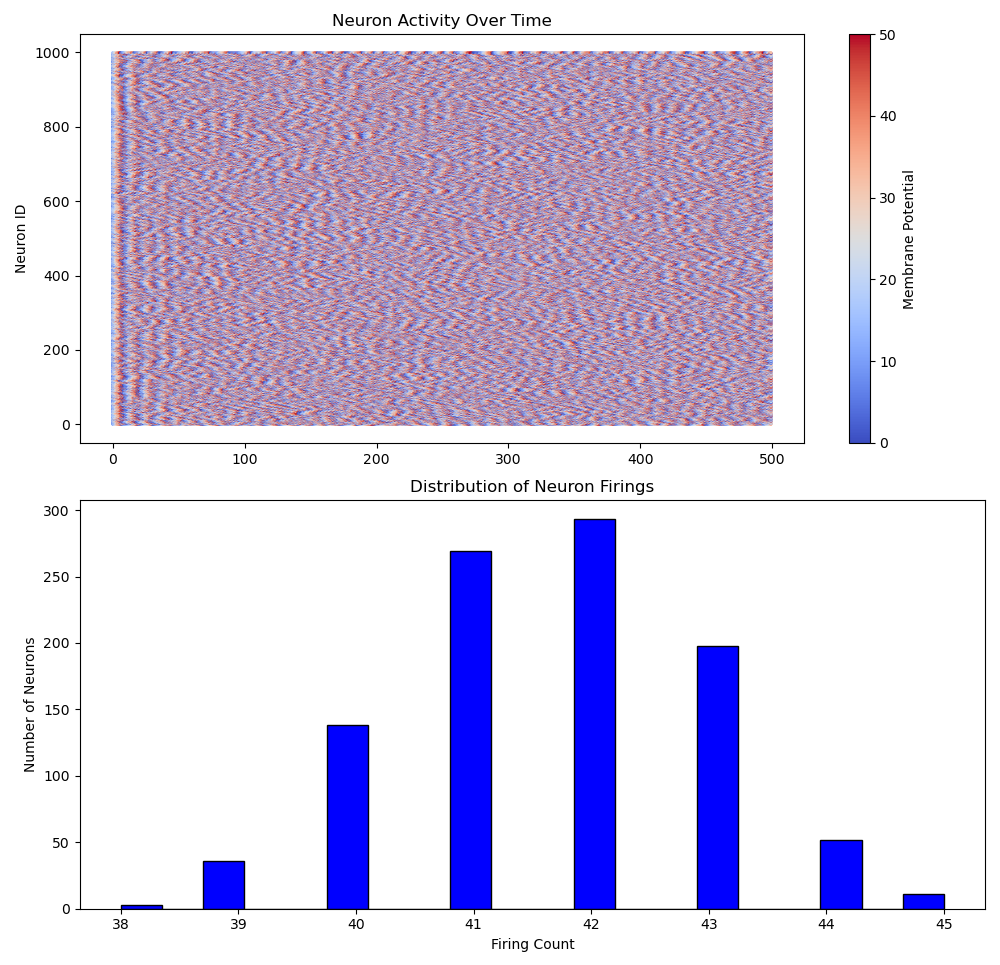
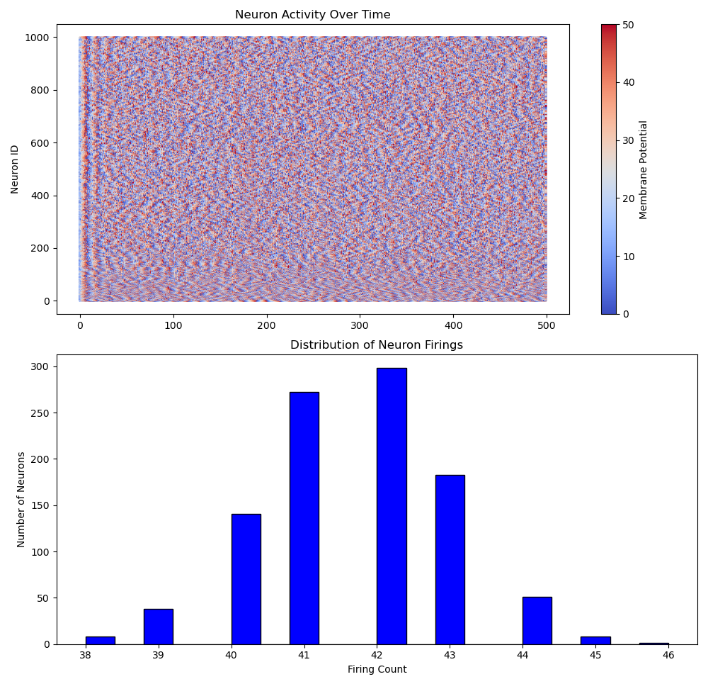
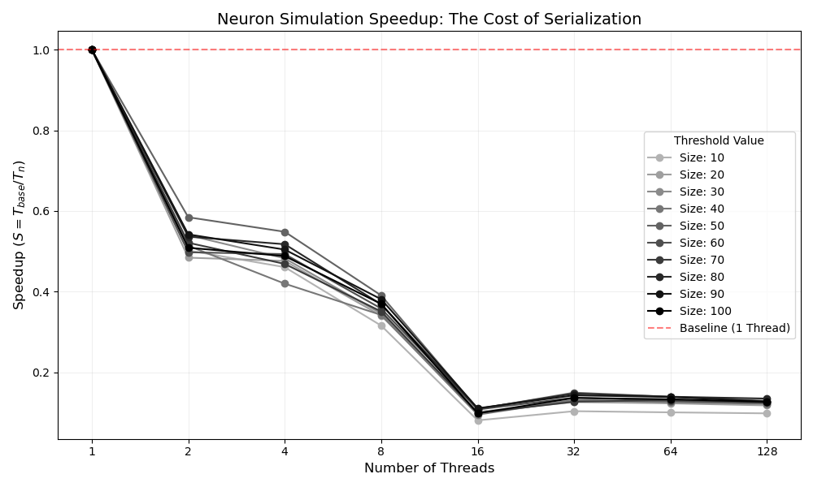

# Bonus
Given that writting the output cannot be paralelized (all threads access the same file), we will not measure that time it takes (given that it has complexity O(N)). The creation of the neurons will not be measured either, although it can be paralelized using OpenMP.

We paralelized the code in the following way

```cpp
void simulate() {
    FILE *f = fopen("neuron_output.txt", "w");
    auto start = omp_get_wtime();

    #pragma omp parallel
    {
        for (int step = 0; step < STEPS; step++)
        {
            #pragma omp single
            {
                for (int i = 0; i < NEURONS; i++) {
                    #pragma omp task shared(potentials, firings, step) firstprivate(i)
                    {
                        potentials[i] += rand() % 10;
                        if (potentials[i] > THRESHOLD) {
                            firings[i]++;
                            potentials[i] = 0;  // Reset potential
                        }
                        fprintf(f, "%d %d %f\n", step, i, potentials[i]);
                    }
                }
            }
        }
    }
    auto end = omp_get_wtime();
    printf("Simulation completed in %f seconds\n", end - start);
    fclose(f);
}
```
The `#pragma omp parallel` ensures that we start a parallel region. This is creating the threads. The `#pragma omp single` is insuring that only a single thread will execute the operations inside. All the threads will execute the first for loop, but it is a neccessary operation (if we put the `#pragma omp parallel` inside the first for loop, we would be creating and destroying the threads multiple times). The single thread is going multiple times over the second loop, for each iteration creating a new task. Each task will be ran by a single thread (like a workpool, let's call it `A`). The aguments for the `#pragma omp task':
- `shared(potentials, firings, step)` means that all threads will have access to the same `potentials`, `firings` and `step` variables. This is necessary because we want all threads to update the same data.
- `firstprivate(i)` means that each thread will have its own copy of the `i`, otherwise the `A` will change `i` before the tasks have time to update.
- `shared(...)` means that all the spawned threads will have access to the same vectors.
For the fprintf, on our local machine we didn't get any scrambled output (only prints being out of order), hence we decided against putting it inside a critical section.
Currently the distribution for the serial version is:



And for the parallel version:


Hence the results are the same.

Regarding the elapsed time, we got the following results:
- Serial version: 0.29 seconds
- Parallel version: 3.03 seconds

"Bruh".
At the same time, all the data is on the same cache line gotten by all the threads, so false sharing =((.

**How does task parallelism differ from loop parallelism?**
Regarding the difference between `#pragma omp task` and `#pragma omp loop`. The task one is creating a task pool. Each time a thread finishes with a neuron, they just get the next task. For the for loop, the entire loop is divided by the nr of threads and a section is given to each of the threads. Given that the operations are of equal duration, it is better to divide and give from the start to each thread a split.

Results for the task:

```bash
serb1231@serb1231:~/Assignment_3_Methods_HPC/ex3$ ./a.out 
Running with 2 threads...
Simulation completed in 0.807757 seconds for 2 threads
Running with 4 threads...
Simulation completed in 0.791564 seconds for 4 threads
Running with 8 threads...
Simulation completed in 0.806189 seconds for 8 threads
Running with 16 threads...
Simulation completed in 3.458162 seconds for 16 threads
Running with 32 threads...
Simulation completed in 1.691918 seconds for 32 threads
Running with 64 threads...
Simulation completed in 1.730394 seconds for 64 threads
Running with 128 threads...
Simulation completed in 1.136145 seconds for 128 threads
```

Results for the for loop:
```bash
serb1231@serb1231:~/Desktop/Assignment_3_Methods_HPC/bonus$ ./a.out 
Running with 2 threads...
Simulation completed in 0.199465 seconds for 2 threads
Running with 4 threads...
Simulation completed in 0.224382 seconds for 4 threads
Running with 8 threads...
Simulation completed in 0.363335 seconds for 8 threads
Running with 16 threads...
Simulation completed in 0.979585 seconds for 16 threads
Running with 32 threads...
Simulation completed in 0.486904 seconds for 32 threads
Running with 64 threads...
Simulation completed in 0.505658 seconds for 64 threads
Running with 128 threads...
Simulation completed in 0.616667 seconds for 128 threads
```

Better results as we can see. Our machine has a maixmum of 16 independent threads, so if we increase further we will not get any better results (but at the same time, if we use 16, we will enter teritory of cpu nodes that are using firefox and other apps). No ideea what happens when we go for 32 threads or higher on this machine. Let the OS do it's thing I guess. Reference `code_loop_par.cpp`.


**How can task dependencies be introduced to simulate neural connections?**
Each neuron is independent of eachother. That means that means that the only task dependency is given by the step. So we can update a neuron at the next step if the one at the last step was done. Hence, we can put a single `inout: potential[i]`. This will signify that even if multiple threads go to multiple steps in the iteration, all of them know there is a dependency based on the nr of steps (cause all of them first found that `inout: potential[i]` on the earlies step, and when they encounterr it on another step, know the dependency).

``` bash
Running with 2 threads...
Simulation completed in 0.247394 seconds for 2 threads
Running with 4 threads...
Simulation completed in 0.274266 seconds for 4 threads
Running with 8 threads...
Simulation completed in 0.345289 seconds for 8 threads
Running with 16 threads...
Simulation completed in 0.624807 seconds for 16 threads
Running with 32 threads...
Simulation completed in 0.543996 seconds for 32 threads
Running with 64 threads...
Simulation completed in 0.969591 seconds for 64 threads
Running with 128 threads...
Simulation completed in 0.546699 seconds for 128 threads
```

The results are similar to the other approaches. Look at `code_task_dep.cpp` for the boring code.
Also, for a real neural connection, a whole iteration has to pass before we do anything, and there are dependencies on neurons (idk, it is late, biology).

**What happens to performance as the number of neurons increases?**
For this question, we decided agains writting a code that will programatically increase the size for neurons. Right now, that data is declared in the .data section of the memory. Because of that, we used a script that will define a the NEURONS variable to be a certain size between 1000 and 10000.


As we can see th speedup is the same for all the sizes of the neurons. That would mean that the overhead for creating tasks and giving them away to threads is much bigger than the compute time of the neuron (incrementing a variable and comparing to a constant). Which would make sense. Approximatelly 10 times as slow creating a task than doing without any tasks.

**How does varying the firing threshold affect the overall neuron activity?**



The speedup is similar. We tested having the threshold from 10 to 100. In hypothesis, having a higher threshold would only decrease the number of times it fires, hence the number of times we would enter that branch. It would only help with the branch prediction. And it quite did:

```bash
Testing size: 10
Running with 1 threads...
time: 0.095370 seconds threads: 1 
Testing size: 20
Running with 1 threads...
time: 0.114515 seconds threads: 1 
...
Testing size: 80
Running with 1 threads...
time: 0.135356 seconds threads: 1 
Testing size: 90
Running with 1 threads...
time: 0.135061 seconds threads: 1 
Testing size: 100
Running with 1 threads...
time: 0.129101 seconds threads: 1 

```


# GPT Usage
For the bonus, every time a `printf` or `fprintf` was written, it was written with copilot (it can write more meaningfull debug and print messages, and the shortcut `ctrl + shift + p` to activate it and deactivate it is just too good when you don't have imagination.
The `plot_time-vs_threads_bonus.py` was done using gemini. It was verified by looking at the resulting plot and the input data.