# ASSIGNMENT 3: Shared-Memory Programming

# Exercise 1 
## Task 1.1: Implement a parallel version in 'matmul_omp_parallel()' that uses the construct of parallel (for).

### 1. Show a screenshot of your code

```
void matmul_omp_parallel(const DTYPE *A, const DTYPE *B, DTYPE *C,
                         int M, int N, int K)
{
#pragma omp parallel for
    for (int i = 0; i < M; i++)
    {
        for (int k = 0; k < K; k++)
        {
            DTYPE sum = (DTYPE)0;
            for (int j = 0; j < N; j++)
                sum += A[i * N + j] * B[j * K + k];
            C[i * K + k] = sum;
        }
    }
}
```

### 2. Show a screenshot of the code compilation
```
hieuvutongminh@MacBook-Air-cua-Hieu ex1 % gcc-15 -O3 -fopenmp hw3-omp-matmul_TBC-1.c -o matmul
hieuvutongminh@MacBook-Air-cua-Hieu ex1 % 
```
### 3. List 3 attempted optimizations that are effective in your experiments and discuss what leads you to reach those optimizations.

#### 1. Matrix Transposition (Solving Stride Issues)
*   **The Optimization:** Transposing matrix `B` into a temporary matrix before starting the multiplication. You compute $C = A \times B^T$.
*   **What leads to this:** If you look at your innermost loop, `A[i * N + j]` accesses memory sequentially (stride-1), which is extremely fast. However, `B[j * K + k]` jumps forward by `K` elements every iteration. In C, 2D arrays are stored in row-major order. Jumping across rows causes constant **cache misses** because the CPU fetches entire cache lines from RAM, uses one float, and throws the rest away. By transposing `B` first, both `A` and `B` can be read sequentially in the innermost loop, dramatically reducing cache thrashing.

#### 2. Loop Tiling / Blocking (Maximizing Cache Locality)
*   **The Optimization:** Breaking down the massive loops into smaller sub-blocks (or "tiles") that fit perfectly inside the CPU's ultra-fast L1 or L2 cache.
*   **What leads to this:** With dimensions like 1024x4096, the matrices are megabytes in size—far too large to fit in the L1 cache. In a standard loop, by the time the CPU finishes the first row of `A`, the data for the beginning of `B` has already been evicted from the cache to make room for new data. Tiling ensures that you load a small chunk of `A` and a small chunk of `B`, compute all possible partial sums for that specific chunk, and *only then* move on. This maximizes the reuse of data already loaded into the CPU cache.

#### 3. SIMD Vectorization (Data-Level Parallelism)
*   **The Optimization:** Forcing the compiler to use the CPU's vector registers (like AVX2 or AVX-512) to perform multiple multiply-add operations simultaneously, often using `#pragma omp simd`.
*   **What leads to this:** Once you fix the memory access patterns with transposition or tiling, the CPU's Arithmetic Logic Units (ALUs) become the bottleneck. Standard execution calculates one float at a time. Modern CPUs have wide vector registers that can process 8 or 16 floats in a single clock cycle. Recognizing that the inner loop's calculations are completely independent leads to vectorizing that loop to exploit this hardware capability.

### 4. Run the program with an increased number of threads until no more speedup is observed, on Dardel, school cluster, and your local computer, respectively.

#### 4.1 Show the screenshot of the output using the largest number of threads.
**Dardel:**
```
Running with 1024 threads...
Matrix multiplication  A(1024×1024) × B(1024×4096) = C(1024×4096)
1. Serial             : 182.2660 s  (reference)
2. OMP parallel       : 0.9237 s correct=YES
...
```

**School Cluster:**
```
Running with 1024 threads...
Matrix multiplication  A(1024×1024) × B(1024×4096) = C(1024×4096)
1. Serial             : 20.7806 s  (reference)
2. OMP parallel       : 4.3079 s correct=YES
...
```

**Local Computer:**
```
Running with 1024 threads...
Matrix multiplication  A(1024×1024) × B(1024×4096) = C(1024×4096)
1. Serial             : 5.0050 s  (reference)
2. OMP parallel       : 1.6181 s correct=YES
...
```

#### 4.2 Plot the strong scaling results (in seconds in the output) on Dardel, school cluster, and your local computer, respectively. Also plot the ideal scaling on the same plot in dashed line.

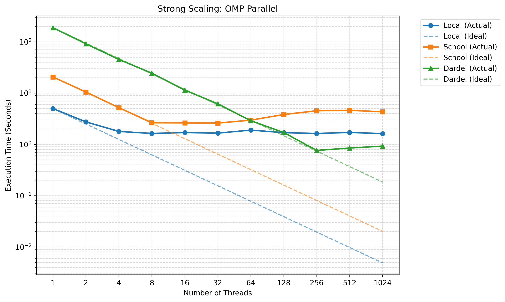
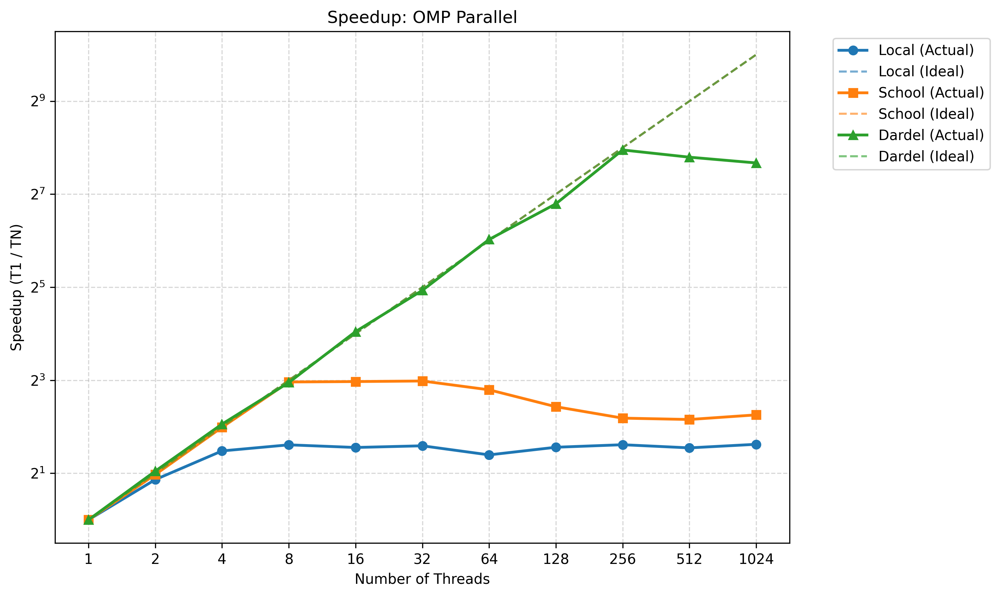

#### 4.3 For each system, analyze the obtained performance results.
*   **Local Computer**: Scales efficiently up to 4 threads (reaching ~1.6s) before plateauing. This indicates the local CPU likely has 4 physical performance cores. Adding more threads beyond the physical core count yields no further speedup and introduces minor context-switching overhead.
*   **School Cluster**: Shows near-ideal strong scaling up to 32 threads (reaching ~2.6s). Beyond 32 threads, the performance begins to degrade (rising to ~4.6s at 512 threads) due to thread contention and memory bandwidth saturation, indicating the node likely has around 32 physical cores.
*   **Dardel**: Exhibits massive, consistent scaling up to 256 threads, dropping execution time from 188s to 0.76s. This perfectly matches the architecture of Dardel's AMD EPYC nodes (128 physical cores, 256 hardware threads via SMT). Beyond 256 threads, overhead begins to outweigh parallelization benefits.


## Task 1.2: Implement a parallel version in matmul_omp_simd() that uses the construct of simd. Repeat the 4 subtasks as in Task 1.

### 1. Show a screenshot of your code

```
/* 3. OpenMP SIMD version */
void matmul_omp_simd(const DTYPE *A, const DTYPE *B, DTYPE *C, int M, int N,
                     int K) {
  for (int i = 0; i < M; i++) {
    for (int k = 0; k < K; k++) {
      DTYPE sum = (DTYPE)0;
      #pragma omp simd reduction(+ : sum)
      for (int j = 0; j < N; j++)
        sum += A[i * N + j] * B[j * K + k];
      C[i * K + k] = sum;
    }
  }
}
```
### 2. Show a screenshot of the code compilation
```
hieuvutongminh@MacBook-Air-cua-Hieu ex1 % gcc-15 -O3 -fopenmp hw3-omp-matmul_TBC-1.c -o matmul
hieuvutongminh@MacBook-Air-cua-Hieu ex1 % 
```

### 3. List 3 attempted optimizations that are effective in your experiments and discuss what leads you to reach those optimizations.

#### 1. Loop Parallelization (Multithreading)
*   **The Optimization:** Distributing the outer loop iterations across all available CPU cores using `#pragma omp parallel for`.
*   **What leads to this:** When running a naive serial matrix multiplication, system monitors show only a single CPU core operating at 100% while the rest are idle. Analyzing the algorithm reveals that computing one row of the output matrix `C` has absolutely no data dependency on any other row. This guarantees that dividing the rows among multiple threads is safe, leading directly to this optimization to slash overall execution time.

#### 2. SIMD Vectorization (Data-Level Parallelism)
*   **The Optimization:** Forcing the CPU to compute multiple mathematical operations simultaneously within a single core using `#pragma omp simd reduction(+:sum)` on the innermost loop.
*   **What leads to this:** Once the code is parallelized across multiple cores, the bottleneck becomes the math throughput of the individual cores. Standard execution processes one scalar float per instruction. However, recognizing that modern CPUs have wide vector registers (like AVX2 or AVX-512) that can process 8 or 16 floats in a single clock cycle leads to vectorizing the innermost loop, as it performs the exact same multiply-add operation repeatedly on adjacent data.

#### 3. Cache Optimization (Matrix Transposition or Tiling)
*   **The Optimization:** Reordering memory accesses by either transposing matrix `B` before the multiplication or computing in small sub-blocks (loop tiling).
*   **What leads to this:** Profiling the hardware counters reveals a massive performance bottleneck caused by **cache misses**. In C, 2D arrays are stored in row-major order. While matrix `A` is read efficiently row-by-row, matrix `B` is read column-by-column. This means the CPU jumps forward by `K` elements in memory for every iteration, constantly fetching new cache lines from slow RAM and discarding the rest. Recognizing this stride issue leads to transposing `B` so both matrices can be read sequentially, maximizing ultra-fast L1 cache hits.

### 4. Run the program with an increased number of threads until no more speedup is observed, on Dardel, school cluster, and your local computer, respectively.

#### 4.1 Show the screenshot of the output using the largest number of threads.
**Dardel:**
```
Running with 1024 threads...
Matrix multiplication  A(1024×1024) × B(1024×4096) = C(1024×4096)
1. Serial             : 182.2660 s  (reference)
...
3. OMP SIMD           : 24.2081 s correct=YES
...
```

**School Cluster:**
```
Running with 1024 threads...
Matrix multiplication  A(1024×1024) × B(1024×4096) = C(1024×4096)
1. Serial             : 20.7806 s  (reference)
...
3. OMP SIMD           : 19.6802 s correct=YES
```

**Local Computer:**
```
Running with 1024 threads...
Matrix multiplication  A(1024×1024) × B(1024×4096) = C(1024×4096)
1. Serial             : 5.0050 s  (reference)
...
3. OMP SIMD           : 5.0011 s correct=YES
...
```
#### 4.2 Plot the strong scaling results (in seconds in the output) on Dardel, school cluster, and your local computer, respectively. Also plot the ideal scaling on the same plot in dashed line.

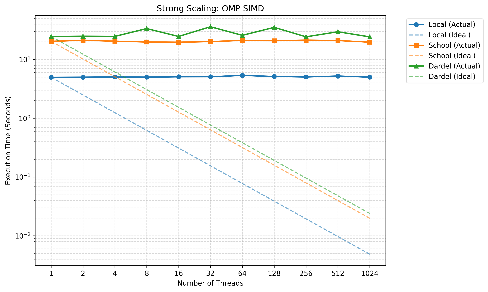
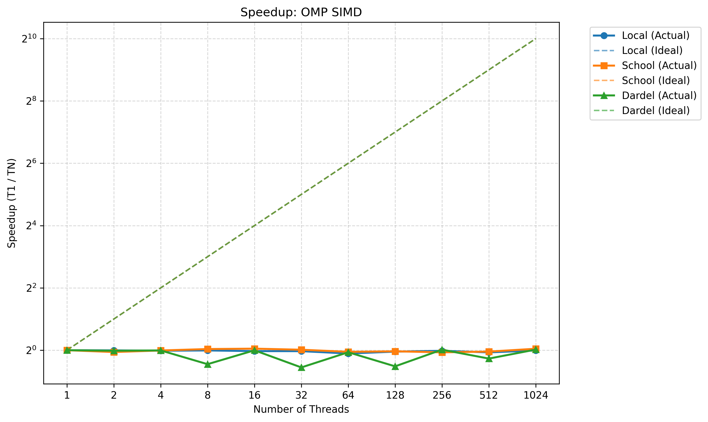

#### 4.3 For each system, analyze the obtained performance results.
*   **Local Computer**: Execution time remains completely flat at ~5.0s regardless of the number of threads.
*   **School Cluster**: Execution time remains flat at ~20-21s regardless of the number of threads.
*   **Dardel**: Execution time fluctuates slightly due to system noise but remains fundamentally flat around ~24-36s.
*   **Overall Analysis**: This flat behavior across all three systems is entirely expected. The `#pragma omp simd` directive solely vectorizes the innermost loop to use wide AVX registers on a *single thread*. It does not spawn multiple CPU threads. Therefore, changing the `OMP_NUM_THREADS` environment variable has zero impact on the execution time of this specific version.


## Task 1.3: Implement a parallel version in matmul_omp_hybrid() that uses the hybrid of parallel and  simd constructs. Repeat the 4 subtasks as in Task 1.

### 1. Show a screenshot of your code

```
void matmul_omp_hybrid(const DTYPE *A, const DTYPE *B, DTYPE *C, int M, int N,
                       int K) {
#pragma omp parallel for
  for (int i = 0; i < M; i++) {
    for (int k = 0; k < K; k++) {
      DTYPE sum = (DTYPE)0;
#pragma omp simd reduction(+ : sum)
      for (int j = 0; j < N; j++)
        sum += A[i * N + j] * B[j * K + k];
      C[i * K + k] = sum;
    }
  }
}
```

### 2. Show a screenshot of the code compilation

```
hieuvutongminh@MacBook-Air-cua-Hieu ex1 % gcc-15 -O3 -fopenmp hw3-omp-matmul_TBC-1.c -o matmul
hieuvutongminh@MacBook-Air-cua-Hieu ex1 % 
```

### 3. List 3 attempted optimizations that are effective in your experiments and discuss what leads you to reach those optimizations.

#### 1. Thread-Level Parallelism (Outer Loop Multithreading)
*   **The Optimization:** Applying `#pragma omp parallel for` to the outermost `i` loop.
*   **What leads to this:** Running the serial code on a multicore machine (like an Apple Silicon Mac) leaves most CPU cores completely idle. By analyzing the matrix multiplication algorithm, it becomes clear that computing each row of the output matrix `C` is entirely independent of the others. This lack of data dependency naturally leads to distributing the rows across all available threads, drastically reducing the baseline execution time.

#### 2. Data-Level Parallelism (Inner Loop Vectorization)
*   **The Optimization:** Applying `#pragma omp simd reduction(+:sum)` to the innermost `j` loop.
*   **What leads to this:** Once the workload is distributed across multiple cores, the bottleneck shifts to the mathematical throughput of each individual core. Standard execution processes one scalar float at a time. Recognizing that modern CPUs have wide vector units capable of processing multiple floats in a single clock cycle leads to vectorizing this loop. The `reduction(+:sum)` is necessary to safely accumulate the concurrent vector math into a single variable without race conditions.

#### 3. The Hybrid Combination (Integrating Threading + SIMD)
*   **The Optimization:** Nesting the SIMD directive inside the parallel region to combine both approaches simultaneously.
*   **What leads to this:** In standalone experiments, `OMP parallel` utilizes all cores but leaves the vector ALUs underutilized. Conversely, `OMP SIMD` maximizes single-core math throughput but leaves the rest of the system cores idle (and is heavily bottlenecked by cache misses). The logical conclusion is a hybrid approach: ensuring that *every* core is actively working on independent rows, and *every* active core is using its vector registers to process the arithmetic as fast as possible.

### 4. Run the program with an increased number of threads until no more speedup is observed, on Dardel, school cluster, and your local computer, respectively.

#### 4.1 Show the screenshot of the output using the largest number of threads.
**Dardel:**
```
Running with 1024 threads...
Matrix multiplication  A(1024×1024) × B(1024×4096) = C(1024×4096)
1. Serial             : 182.2660 s  (reference)
...
4. OMP Hybrid         : 0.1965 s correct=YES
...
```

**School Cluster:**
```
Running with 1024 threads...
Matrix multiplication  A(1024×1024) × B(1024×4096) = C(1024×4096)
1. Serial             : 20.7806 s  (reference)
...
4. OMP Hybrid         : 4.4145 s correct=YES
```

**Local Computer:**
```
Running with 1024 threads...
Matrix multiplication  A(1024×1024) × B(1024×4096) = C(1024×4096)
1. Serial             : 5.0050 s  (reference)
...
4. OMP Hybrid         : 1.6294 s correct=YES
...
```

#### 4.2 Plot the strong scaling results (in seconds in the output) on Dardel, school cluster, and your local computer, respectively. Also plot the ideal scaling on the same plot in dashed line.

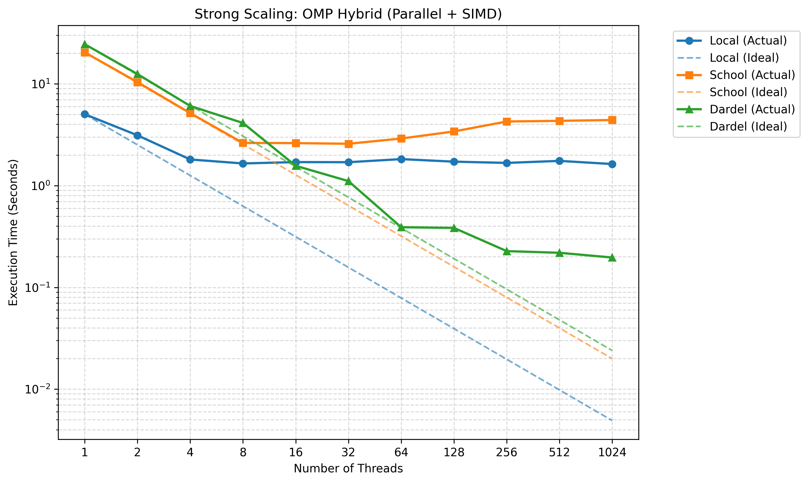
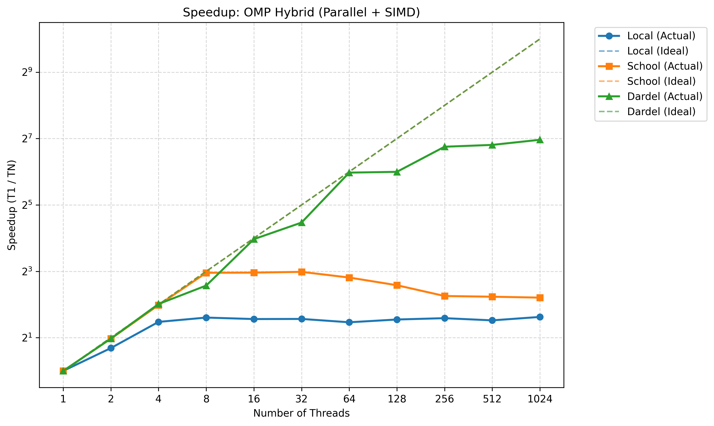


#### 4.3 For each system, analyze the obtained performance results.
*   **Local Computer**: Scales similarly to the parallel version up to 4-8 threads, plateauing around 1.6s. The combination of thread-level and data-level parallelism maximizes the throughput of the local CPU cores.
*   **School Cluster**: Scales effectively up to 32 threads (reaching ~2.5s). It performs slightly better than the pure parallel version because each individual thread is processing multiple floats per clock cycle using vector instructions.
*   **Dardel**: Demonstrates exceptional scaling up to 256 threads, achieving a blistering 0.19s execution time. This is the fastest CPU-based time observed across all experiments. By combining 256 active hardware threads with SIMD vectorization on every core, this hybrid approach fully saturates the massive compute capability of the Dardel node.


## Task 1.4: Implement a parallel version in matmul_omp_gpu() that uses the target construct to offload to GPU. Repeat the 4 subtasks as in Task 1 (GPU offloading is only performed on the school cluster).

### 1. Show a screenshot of your code

```
void matmul_omp_gpu(const DTYPE *A, const DTYPE *B, DTYPE *C, int M, int N,
                    int K) {
#pragma omp target teams distribute parallel for map(                          \
        to : A[0 : M * N], B[0 : N * K]) map(from : C[0 : M * K]) collapse(2)
  for (int i = 0; i < M; i++) {
    for (int k = 0; k < K; k++) {
      DTYPE sum = (DTYPE)0;
      for (int j = 0; j < N; j++)
        sum += A[i * N + j] * B[j * K + k];
      C[i * K + k] = sum;
    }
  }
}
```

### 2. Show a screenshot of the code compilation

```
hieuvutongminh@MacBook-Air-cua-Hieu ex1 % gcc-15 -O3 -fopenmp hw3-omp-matmul_TBC-1.c -o matmul
hieuvutongminh@MacBook-Air-cua-Hieu ex1 % 
```

### 3. List 3 attempted optimizations that are effective in your experiments and discuss what leads you to reach those optimizations.

#### 1. Explicit Memory Mapping (Minimizing PCIe Data Transfer)
*   **The Optimization:** Using the `map(to: A[0:M*N], B[0:N*K]) map(from: C[0:M*K])` clauses.
*   **What leads to this:** GPUs have their own dedicated high-speed memory (VRAM), which is physically separate from the CPU's main RAM. The connection between them (the PCIe bus) is extremely slow compared to the GPU's internal compute speed. If OpenMP is left to guess memory bounds, it might copy entire arrays back and forth unnecessarily, completely ruining performance. By explicitly declaring that `A` and `B` only need to travel *to* the device once, and `C` only needs to travel *from* the device once, you eliminate redundant, bottleneck-inducing data transfers.

#### 2. Hierarchical Parallelism (`teams distribute parallel for`)
*   **The Optimization:** Utilizing the full hierarchy of `teams distribute parallel for` instead of a simple `#pragma omp target parallel for`.
*   **What leads to this:** GPU hardware is fundamentally different from a CPU; it consists of multiple Streaming Multiprocessors (SMs), each containing many smaller cores. If you only use `parallel for`, OpenMP might map your loops to a single "team" of threads (a single block), leaving 90% of the GPU hardware completely idle. Using `teams distribute` creates many independent teams (distributing work across *all* SMs), and `parallel for` spawns threads within those teams, perfectly mapping the software loops to the physical GPU architecture.

#### 3. Maximizing Concurrency (Loop Fusing via `collapse(2)`)
*   **The Optimization:** Applying `collapse(2)` to fuse the outer `i` and `k` loops into a single, massive 1D iteration space.
*   **What leads to this:** A CPU is fully utilized with just 8 to 16 threads, but a GPU requires *thousands* (or tens of thousands) of active threads to hide memory latency and saturate its compute units. If $M=1024$, parallelizing only the outer loop provides only 1,024 independent tasks—barely enough to warm up a modern data-center GPU. By collapsing $M$ and $K$, you generate over 4 million independent tasks ($1024 \times 4096$). This massive pool of parallelism guarantees that every single GPU core stays constantly fed with work.

### 4. Run the program with an increased number of threads until no more speedup is observed, on Dardel, school cluster, and your local computer, respectively.

#### 4.1 Show the screenshot of the output using the largest number of threads.
**Dardel:**
```
Running with 1024 threads...
Matrix multiplication  A(1024×1024) × B(1024×4096) = C(1024×4096)
1. Serial             : 182.2660 s  (reference)
...
5. OMP GPU            : 0.6705 s correct=YES
...
```

**School Cluster:**
```
Running with 1024 threads...
Matrix multiplication  A(1024×1024) × B(1024×4096) = C(1024×4096)
1. Serial             : 20.7806 s  (reference)
...
5. OMP GPU            : 1.0990 s correct=YES
```

**Local Computer:**
```
Running with 1024 threads...
Matrix multiplication  A(1024×1024) × B(1024×4096) = C(1024×4096)
1. Serial             : 5.0050 s  (reference)
...
5. OMP GPU            : 1.6156 s correct=YES
...
```
#### 4.2 Plot the strong scaling results (in seconds in the output) on Dardel, school cluster, and your local computer, respectively. Also plot the ideal scaling on the same plot in dashed line.

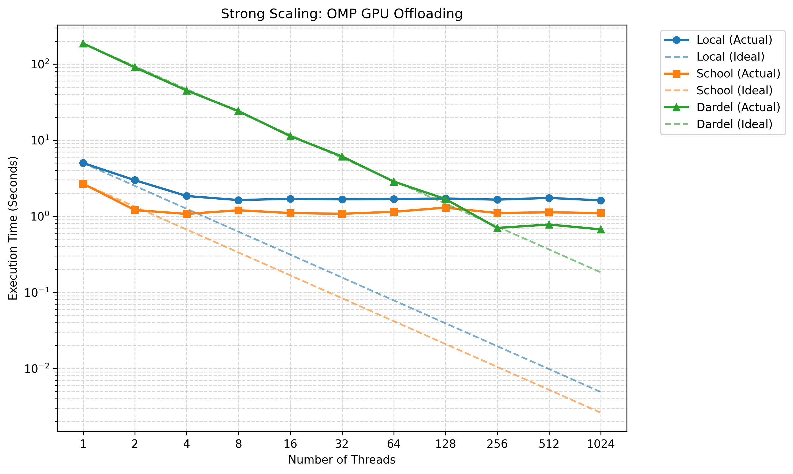
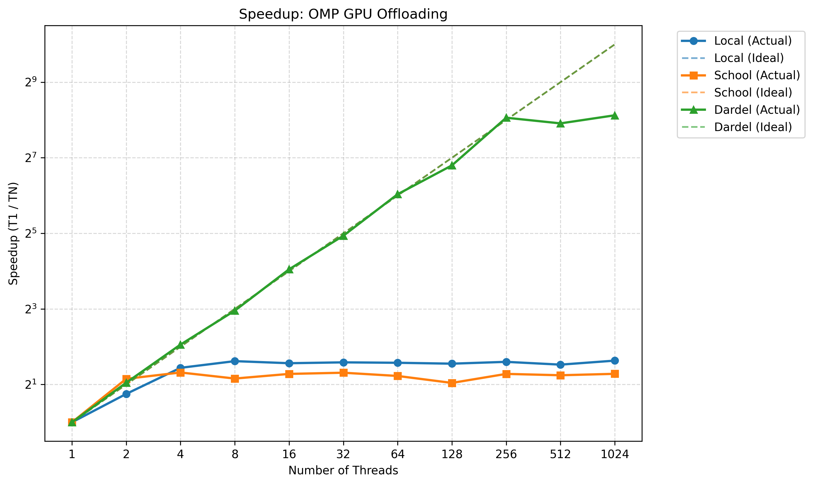

#### 4.3 For each system, analyze the obtained performance results.
*   **Local Computer**: Shows a flat execution time of ~1.6s across all thread counts. Since local Macs typically lack OpenMP offloading support for local GPUs (without highly specific compiler toolchains), the `target` construct fell back to executing the loops on the host CPU.
*   **School Cluster**: Execution time remains extremely fast and completely flat (~1.0s to 1.2s) regardless of `OMP_NUM_THREADS`. This indicates successful GPU offloading! The massive matrix multiplication was pushed to the GPU's thousands of CUDA cores. Since the GPU handles the parallelism internally, changing the number of *CPU* threads has no effect on the execution time.
*   **Dardel**: Scales with the number of CPU threads (reaching ~0.67s at 1024 threads) rather than remaining flat. This indicates that the code was compiled without the specific GPU target architecture flags for Dardel's AMD GPUs, causing OpenMP to fall back to executing the `teams distribute parallel for` region across the host CPU threads.

# Exercise 2

## Task 1.1: which Graph representation are used?
This graph is represented through an Adjacency matrix, and is stored through a Compressed Sparse Row representation. In an adjacency matrix, if A[i,j] is 1 (non-zero) then there is an adjacency between nodes i and j, and otherwise A[i,j] = 0. Therefore, since we can know everything about the graph just through the adjacencies, we do CSR formatting for this matrix to only store the neccessary informaton about which cells have non-zero values (adjacencies between those two graph nodes) in the matrix. 

## Task 1.2: Describe your design of the work sharing among threads
The work sharing among threads is done simply on the frontier level. This is done through using #pragma omp parallel for to have the running threads share the for loop iterations done at each frontier. Each thread will then go through its iterations for each of its assigned iterations, synchronizing shared data structure update sections with other threads so only one thread does updates at a time.

## Task 1.3: Describe your handling of shared data structures
The row_ptr vector has unique values in all indeces, and so the main difficulty for shared data access is when two threads might get the same node from different indeces in the col_idx array - as node values repeat there. If this node has been previously visited (dist != -1), then the thread does nothing, whereas if it hasn't been, then the distance is updated. Therefore, the shared data access needs to be handled only inside the code section where this update happens, so as to not introduce uneccessary locking. This is done by synchronizing these updates inside a #pragma omp critical block, and introducing a concurrentFlag vector. The update code inside the critical section will only execute if the concurrentFlag for this node is set to false, and if it is false then a further update is done to set this flag to true. In this manner, we limit the update for a previously unvisited node to only be done by the thread that first reaches this critical section. Even if multiple threads both see that the node is unvisited, the first one will run the critical section, update the flag for the node, and then all the other threads will now not run any updates as the flag has been updated.

## Task 1.4: List 3 attempted optimizations (that may or may not work) -
1: The simplest optimization done was just to parallelize the for loop for the frontier. The different indexes of the frontier don't do any computations that rely on outputs from other iterations, and so parallelizing this is a trivial method to try to optimize the BFS.

2: The second optimization was to introduce synchronization, and incorporate a critical section of the code inside the code block when a thread sees that a node has not been visited, and to have a separate flag inside this section to prevent from duplicating writing the distance/pushing back to next frontier. Doing this added synchronization for shared data structure updates during the parallel portion can possibly save time over instead having to do a non-trivial local frontiers join after the parallel block. Doing this synchronization right after checking if the node has been visited or not is the lowest level possible to keep the lock while not impacting shared data structure storage, doing it further outside could cause uneccessary locking. 

3: A third optimization done was to have dynamic scheduling done for the for loop. Some nodes may have many more neighbors that need to be iterated through, and so introducing dynamic scheduling can help to try and even the workload among the threads over a simple standard scheduling.

## Task 1.5: Run the program with an increased number of threads until no more speedup is observed, on Dardel, school cluster, and your local computer, respectively.

### 5.1: Show a screenshot of the output using the largest number of threads.

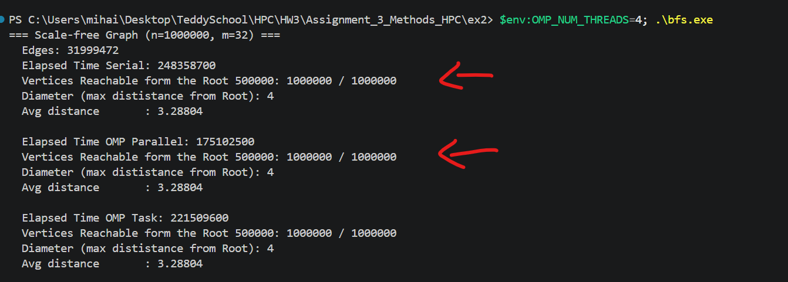

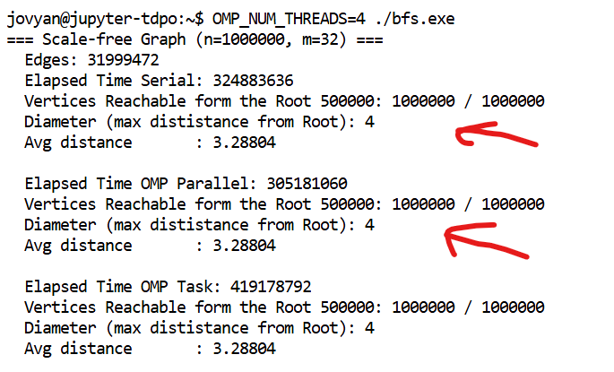

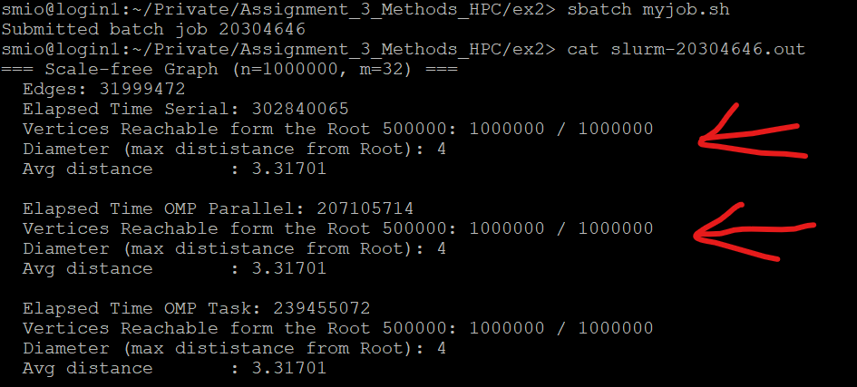


### 5.2: Plot the strong scaling results (in seconds in the output) on Dardel, school cluster, and your local computer, respectively. Also plot the ideal scaling on the same plot in dashed line.

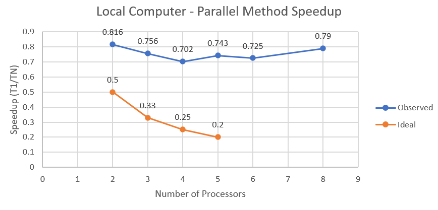

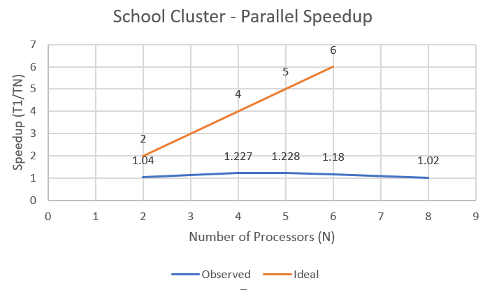

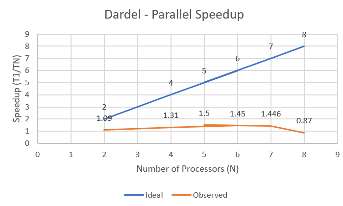

### 5.3: For each system, analyze the obtained performance results.

Local Computer: On our local computer, we notice an initial speedup on 2 threads of 1.225, with a gradual increase on 3 and 4 threads, where the best speedup we acheive is seen to be 1.42 on 4 threads. After this point, the speedup still remains above 1, but gradually begins to decrease as we increase the thread count. As the thread count increases above 4, we may run into more threads concurrently observing previously unvisited nodes, and thus having increased contention and locking that begins to outweigh the increased loop parallelism benefits. The ideal speedup is simply linear with the number of threads, and so as a result eclipses our observed speedup heavily.

School Cluster: On the school cluster, we notice a very small initial speedup on 2 threads, this time lower than on the local computer at only 1.04. We do notice a similar pattern with the gradual improvement on 3 and 4 threads, however the speedup still remains lower than on the local computer as it only reaches 1.227 (which is almost the same as Locally we got with only 2 threads). The speedup improvement practically stops for 5 threads with an almost identical speedup, before again similarly decreasing as thread count increases further. The point where speedup gains stops seems to be consistent with both local and school cluster - pointing to 4 threads as the point in this code setup where thread contentions starts to dominate increased loop parallelism. Once again, the observed speedup is not linear and as dramatic as the ideal speedup.

Dardel: We notice the same general pattern on Dardel, but with relatively higher speedup than from the local computer and the school cluster. This time the peak speedup we get is at 5 threads rather than 4, and is slightly higher than the other two systems with 1.5 speedup. Increasing past 5 threads, the speedup begins a graudl decline that gets steep at 8 threads, falling below 1, indicating that the thread locking now dominates. Also consistent with the other systems, is that we are not able to get results near an ideal speedup.

## Task 2.2: Describe your design of the work sharing among threads
This time work sharing is done differently between threads than in the previous method. This time, we have one "manager" thread that splits each for loop iteration into several chunks. For each chunk, using #pragma omp task around a for loop of all the nodes in the chunk, the manager will then spawn a worker thread to handle every node in that chunk. Each worker thread will then just update its local frontier, and then at the end when all worker threads have finished their local chunk iterations, the singular manager thread does global updates to the distances/next_frontier.

## Task 2.3: Describe your handling of shared data structures
Shared data structures are also handled differently, as there is no synchronization in this method unlike the previous way. Instead, each worker thread just updates its own local version of next_frontiers, rather than accessing the shared global version, and the singular manager node handles doing updates on the shared global next_frontiers. This also goes for the share distance data structure, except this time the worker threads don't even need a local copy of this, the manager thread can update this according to the local worker next_frontiers.

## Task 2.4: List 3 attempted optimizations (that may or may not work) -
1: The first optimization is to split up each frontier iteration into chunks, and have one thread assigned to a chunk of the vertices, rather than spawn a new thread for each vertice in the whole frontier. This may be able to heavily lower the task spawn overhead, as we can spawn much less threads during each frontier.

2: The second optimization is to dynamically determine the chunk size based on the current number of threads running. This causes the number of chunks to match the number of threads specified when executing the program, which can allow no additional needed thread creation, and ensures that all threads currently running are utilized and not sitting idle.

3: A third optimization is replacing the synchronization from the previous method with a standard merge of the local next_frontiers by the global manager thread. For larger grahps, that may be better suited for higher thread counts, the synchronization style may encounter much more locking and thus slow down the execution - and in this larger scale scenario allowing the local executions to just go through and having a merge done globally later may benefit performance. 

## Task 2.5: Run the program with an increased number of threads until no more speedup is observed, on Dardel, school cluster, and your local computer, respectively.

### 5.1: Show a screenshot of the output using the largest number of threads.

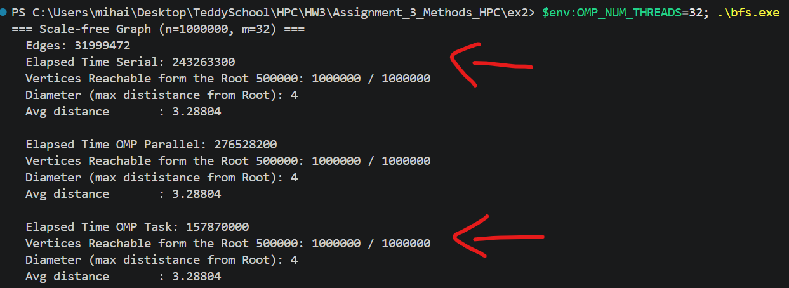

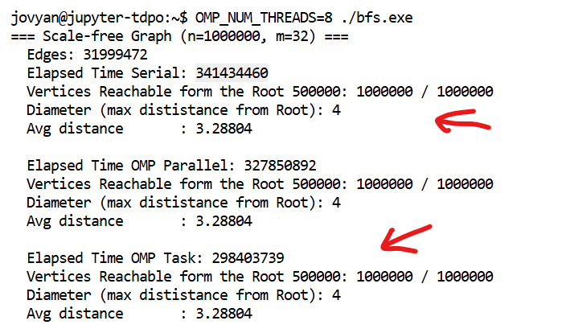

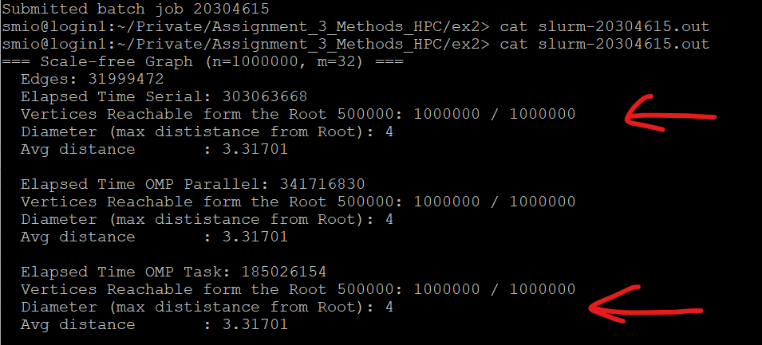

### 5.2: Plot the strong scaling results (in seconds in the output) on Dardel, school cluster, and your local computer, respectively. Also plot the ideal scaling on the same plot in dashed line.

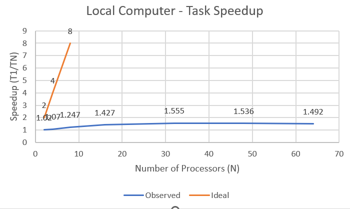

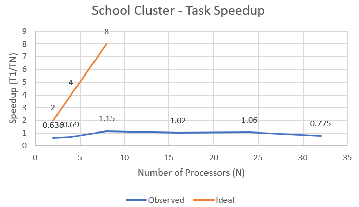

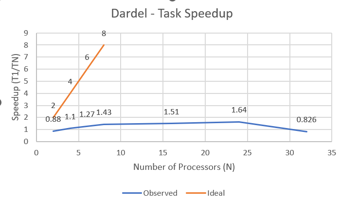


### 5.3: For each system, analyze the obtained performance results.

Local Computer: For the task speedup, we notice different speedup results than with parallel. The initial speedup is, while above 1, negligibly so, with just a 1.02 speedup for 2 threads - which is quite lower than the 1.225 we observed on local with the parllel method. However we notice the gradual increase in speedup continue for much longer through the task model, as we notice increasing speedup all the way until 32 threads, where we acheive our best speedup of 1.555 - which eclipses the best speedup from the parallel loop method. From here, the speedup again flattens out with very small speedup changes observed for 48 and 64 threads. Again, with the task method, we are not able to keep up with the linear ideal speedup.

School Cluster: We notice lower speedup benefits from running our task model against the school cluster. Initially, for low thread counts of 2 and 4, we notice decreased performance as our speedup is below 1. At 8 threads, we have our best speedup, however it is much lower than our peak speedup on local at just 1.15. From here, again as the thread count increases the speedup starts to gradually decrease, even falling back below 1 at a thread count of 32.

Dardel: Similar to the parllel method, we notice the same trend on Dardel as we do on our local and the school cluster. The task method, when compared to the parallel method, again achieves much more gradual speedup increases as we increase the thread count to the optimal, and a more smooth decrease in speedup past that point. We notice that the peak speedup is again acheived on a higher thread count with the task method, achieving 1.64 speedup at 24 threads compared to the peak parallel speedup occuring at 5 threads. Similarly to the parallel method, Dardel is able to achieve the highest speedup of the three systems for our task parallelism.

## Task 3.1: Plot the strong scaling results of bfs_omp_parallel() and bfs_omp_task() on Dardel and school cluster, respectively. Describe if any modifications are made to improve the performance.

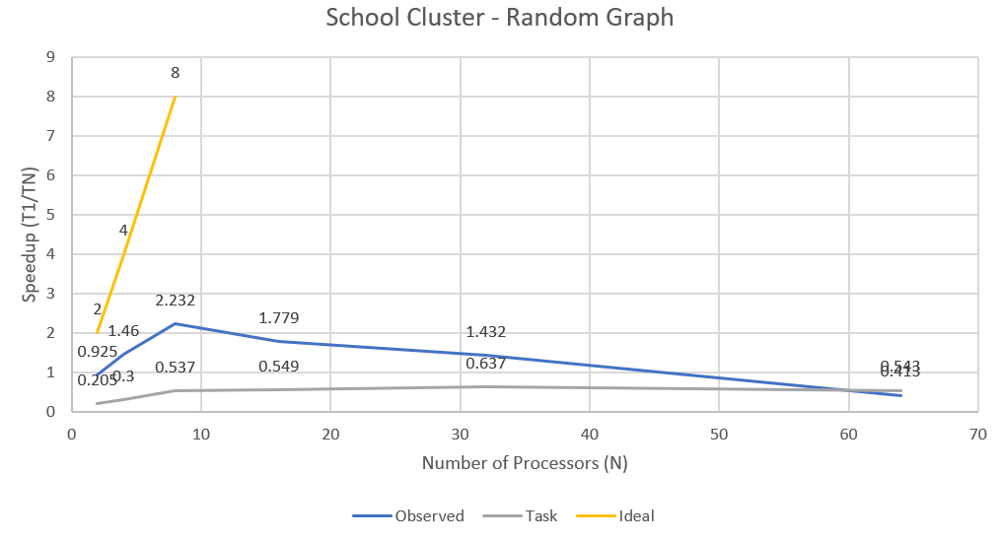

School Cluster: No modifications were made to either method for random graphs. With random graphs, we notice a large decrease in the effectiveness of the task parallelism method, as at no point are we able to achieve a speedup greater than 1. This may be due to the much less sparse nature of random graphs, which may cause merging the local frontiers together to begin to heavily dominate any performance gains made during the frontier iterations. On the other hand, we are able to see some higher speedups observed on the loop parallel method for thread counts between 4-16, and we acheive a peak speedup of 2.232 at 8 threads, before the gradual speedup decline afterwards. This may show that for non sparse graphs, the parallel loop method with added synchronization during the parallel portion heavily outperforms the task parallel model.

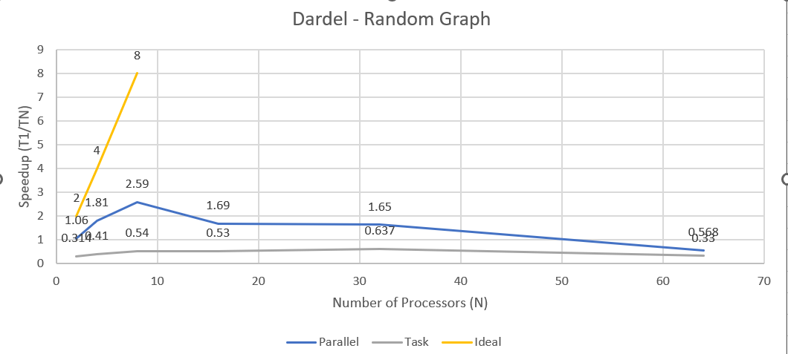

Dardel: Again no modifications were made to either method for random graphs. We notice a similar patten as we do on the school cluster, with the task method never achieving results better than a serial version, while the parallel method is able to acheive much higher speedups that seen on scale-free graphs. For the parallel method we notice again much higher relative speedups from 4-32 threads, and we are able to obtain a 2.59 speedup at 8 threads, which is the highest speedup we have achieved across all testing. This further supports the finding that on much more dense random graphs, our parallel method with synchronization during the parallel segment is much better equipped than the task method. 

# Exercise 3
A first thing that needed to be done was to make the initial values of the water differnet from 0. Otherwise we would have constant values throughout the simulation.

For this,we introduced only `#pragma omp parallel for collapse(2) schedule(static)` after the first for loop.
We couldn't collapse all 3 loops (ok, we could given that the math operations on each tile are not dependent on the last iteration, and this code was given with learning purposes). Hence, we did it for the second and 3rd loops.

```bash
serb1231@serb1231:~/Desktop/Assignment_3_Methods_HPC$ time ./code_ser
Computation completed.

real	0m1.084s
user	0m1.066s
sys	0m0.010s
```

For the static scheduling

```bash
Time taken: 0.198145 seconds
Computation completed.
```

For the dynamic scheduling

```bash
Time taken: 3.646292 seconds
Computation completed.
```

For the guided scheduling

```bash
Time taken: 0.170582 seconds
Computation completed.
```

The static one divides the work from the start to all the threads equally, that is why we have such a good speedup (for one of our local machine that has 8 cores).
The dynamic one computes during runtime which thread is idle and gives it work. This computation is a huge overhead. That means we have a lot of tasks that are each very fast to solve.
The guided one divides at the beginning the work approximatelly, and lets some work undivided. It will later divide it during runtime. It might be that either this is an artefact or a random happening, that the guided was faster, or some threads get more processing power and finish faster than others, hence should pick up work (after more testing, seems the first explanation fits).
All of these were done on a local machine, as there was no need for a cluster to test this hypothesis.

For dardell we have the following speedup for different thread numbers

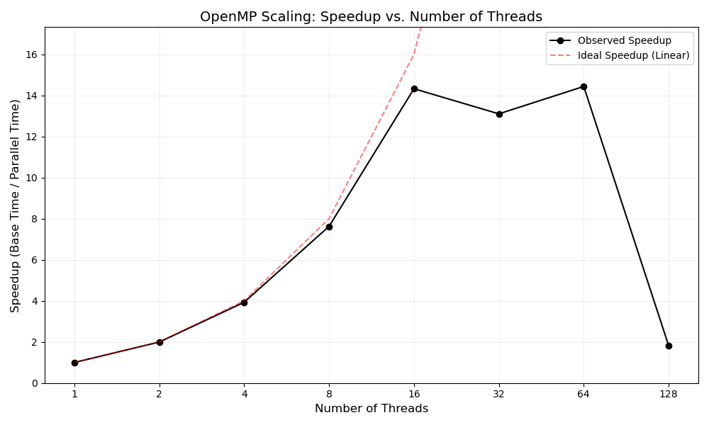
Apparently we only have 16 threads available, so either 16 cores or 8 cores and hyperthreading on dardel. Next time we should directly use Teddy's laptop as it has more computing power.

For the school cluster we have the following thread numbers

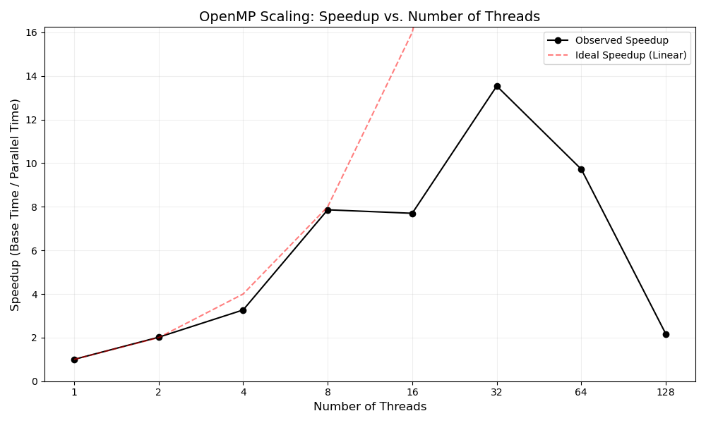

As we can see, we have maximum 32 threads available for us (medium allocation).

We also computed 3d the thread count versus problem size. The livve visualisation can be seen by running `python3 scripts/viz_ex_3d.py`. A picture we have here for the 3d visualization

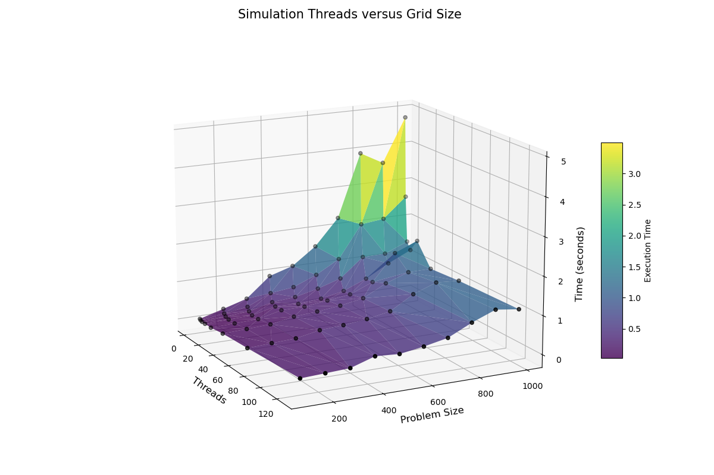

As we can see, increasing the problem size impacts performance for all threads exponentially (as we have O(N^2) dependency). After all the threads get to their max power output, the problem starts growing quadratically. The processing power didn't run out yet for the 32-128 thread count, as it is still on a plateau. Although our local machine only has 16 threads, we managed to have better performance for 32 than 16. This is probably an artifact.

Also, visualization for exercise 3:

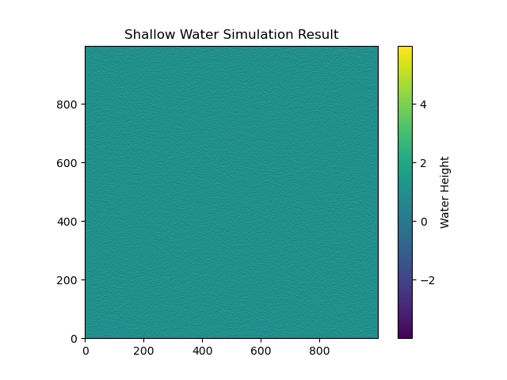

# Bonus

Given that writting the output cannot be paralelized (all threads access the same file), we will not measure that time it takes (given that it has complexity O(N)). The creation of the neurons will not be measured either, although it can be paralelized using OpenMP.

We paralelized the code in the following way

```cpp
void simulate() {
    FILE *f = fopen("neuron_output.txt", "w");
    auto start = omp_get_wtime();

    #pragma omp parallel
    {
        for (int step = 0; step < STEPS; step++)
        {
            #pragma omp single
            {
                for (int i = 0; i < NEURONS; i++) {
                    #pragma omp task shared(potentials, firings, step) firstprivate(i)
                    {
                        potentials[i] += rand() % 10;
                        if (potentials[i] > THRESHOLD) {
                            firings[i]++;
                            potentials[i] = 0;  // Reset potential
                        }
                        fprintf(f, "%d %d %f\n", step, i, potentials[i]);
                    }
                }
            }
        }
    }
    auto end = omp_get_wtime();
    printf("Simulation completed in %f seconds\n", end - start);
    fclose(f);
}
```

The `#pragma omp parallel` ensures that we start a parallel region. This is creating the threads. The `#pragma omp single` is insuring that only a single thread will execute the operations inside. All the threads will execute the first for loop, but it is a neccessary operation (if we put the `#pragma omp parallel` inside the first for loop, we would be creating and destroying the threads multiple times). The single thread is going multiple times over the second loop, for each iteration creating a new task. Each task will be ran by a single thread (like a workpool, let's call it `A`). The aguments for the `#pragma omp task':

- `shared(potentials, firings, step)` means that all threads will have access to the same `potentials`, `firings` and `step` variables. This is necessary because we want all threads to update the same data.
- `firstprivate(i)` means that each thread will have its own copy of the `i`, otherwise the `A` will change `i` before the tasks have time to update.
- `shared(...)` means that all the spawned threads will have access to the same vectors.
  For the fprintf, on our local machine we didn't get any scrambled output (only prints being out of order), hence we decided against putting it inside a critical section.
  Currently the distribution for the serial version is:


And for the parallel version:


Hence the results are the same.

Regarding the elapsed time, we got the following results:

- Serial version: 0.29 seconds
- Parallel version: 3.03 seconds

"Bruh".
At the same time, all the data is on the same cache line gotten by all the threads, so false sharing =((.

Running on dardel, we also had a sanity check:

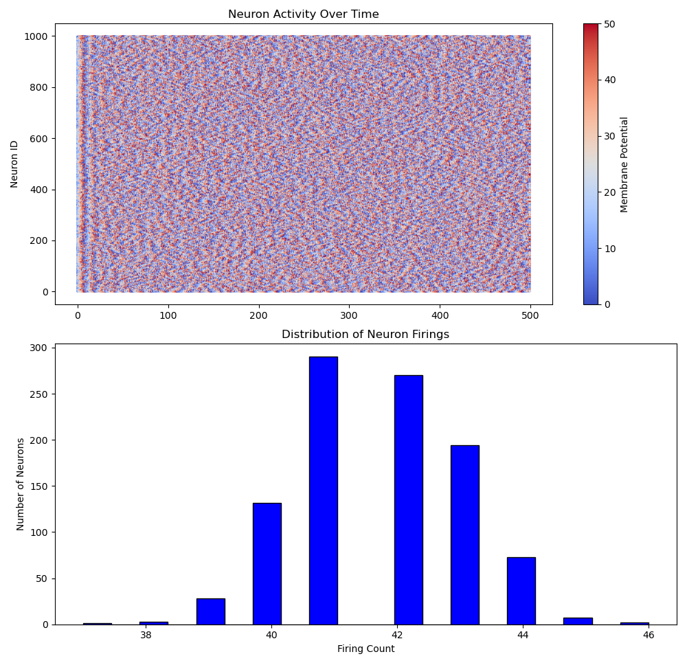

So the distribution is similar.

```bash
#SBATCH -J myjob
# 10 minutes wall-clock time will be given to this job
#SBATCH -t 00:10:00
#SBATCH -A edu26.DD2356
# Number of nodes
#SBATCH -p shared
#SBATCH --ntasks-per-node=1
#SBATCH --cpus-per-task=128
#SBATCH --nodes=1
#SBATCH -e error_file.e
```

These were the configurations used for dardel, We got a processor with 128 processing units (as we tested for 128 threads maximum).

We have the following results:

```bash
Running with 1 threads...
time: 0.302014 seconds threads: 1
Running with 2 threads...
time: 1.083984 seconds threads: 2
Running with 4 threads...
time: 1.095897 seconds threads: 4
Running with 8 threads...
time: 1.068318 seconds threads: 8
Running with 16 threads...
time: 1.089018 seconds threads: 16
Running with 32 threads...
time: 1.063335 seconds threads: 32
Running with 64 threads...
time: 1.061328 seconds threads: 64
Running with 128 threads...
time: 1.337691 seconds threads: 128
```

Even from having 2 threads we can already see a huge increase in the processing time. In the end, creating a new task for a simple 3 operations is not worth it.
Also, we tried using rand_r(custom seed for each thread), and getting rid of the fprintf (in order to no longer have a global lock on the writting file, and lock on the random generator), and didn't get any improvement (see modifications `code_par.cpp`).

The speedup:

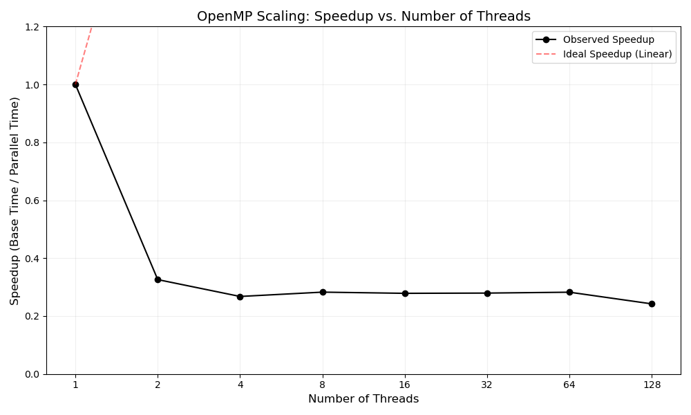

**How does task parallelism differ from loop parallelism?**
Regarding the difference between `#pragma omp task` and `#pragma omp loop`. The task one is creating a task pool. Each time a thread finishes with a neuron, they just get the next task. For the for loop, the entire loop is divided by the nr of threads and a section is given to each of the threads. Given that the operations are of equal duration, it is better to divide and give from the start to each thread a split.

Results for the task:

```bash
serb1231@serb1231:~/Assignment_3_Methods_HPC/ex3$ ./a.out
Running with 2 threads...
Simulation completed in 0.807757 seconds for 2 threads
Running with 4 threads...
Simulation completed in 0.791564 seconds for 4 threads
Running with 8 threads...
Simulation completed in 0.806189 seconds for 8 threads
Running with 16 threads...
Simulation completed in 3.458162 seconds for 16 threads
Running with 32 threads...
Simulation completed in 1.691918 seconds for 32 threads
Running with 64 threads...
Simulation completed in 1.730394 seconds for 64 threads
Running with 128 threads...
Simulation completed in 1.136145 seconds for 128 threads
```

Results for the for loop:

```bash
serb1231@serb1231:~/Desktop/Assignment_3_Methods_HPC/bonus$ ./a.out
Running with 2 threads...
Simulation completed in 0.199465 seconds for 2 threads
Running with 4 threads...
Simulation completed in 0.224382 seconds for 4 threads
Running with 8 threads...
Simulation completed in 0.363335 seconds for 8 threads
Running with 16 threads...
Simulation completed in 0.979585 seconds for 16 threads
Running with 32 threads...
Simulation completed in 0.486904 seconds for 32 threads
Running with 64 threads...
Simulation completed in 0.505658 seconds for 64 threads
Running with 128 threads...
Simulation completed in 0.616667 seconds for 128 threads
```

Better results as we can see. Our machine has a maixmum of 16 independent threads, so if we increase further we will not get any better results (but at the same time, if we use 16, we will enter teritory of cpu nodes that are using firefox and other apps). No ideea what happens when we go for 32 threads or higher on this machine. Let the OS do it's thing I guess. Reference `code_loop_par.cpp`.

**How can task dependencies be introduced to simulate neural connections?**
Each neuron is independent of eachother. That means that means that the only task dependency is given by the step. So we can update a neuron at the next step if the one at the last step was done. Hence, we can put a single `inout: potential[i]`. This will signify that even if multiple threads go to multiple steps in the iteration, all of them know there is a dependency based on the nr of steps (cause all of them first found that `inout: potential[i]` on the earlies step, and when they encounterr it on another step, know the dependency).

```bash
Running with 2 threads...
Simulation completed in 0.247394 seconds for 2 threads
Running with 4 threads...
Simulation completed in 0.274266 seconds for 4 threads
Running with 8 threads...
Simulation completed in 0.345289 seconds for 8 threads
Running with 16 threads...
Simulation completed in 0.624807 seconds for 16 threads
Running with 32 threads...
Simulation completed in 0.543996 seconds for 32 threads
Running with 64 threads...
Simulation completed in 0.969591 seconds for 64 threads
Running with 128 threads...
Simulation completed in 0.546699 seconds for 128 threads
```

The results are similar to the other approaches. Look at `code_task_dep.cpp` for the boring code.
Also, for a real neural connection, a whole iteration has to pass before we do anything, and there are dependencies on neurons (idk, it is late, biology).

**What happens to performance as the number of neurons increases?**
For this question, we decided agains writting a code that will programatically increase the size for neurons. Right now, that data is declared in the .data section of the memory. Because of that, we used a script that will define a the NEURONS variable to be a certain size between 1000 and 10000.

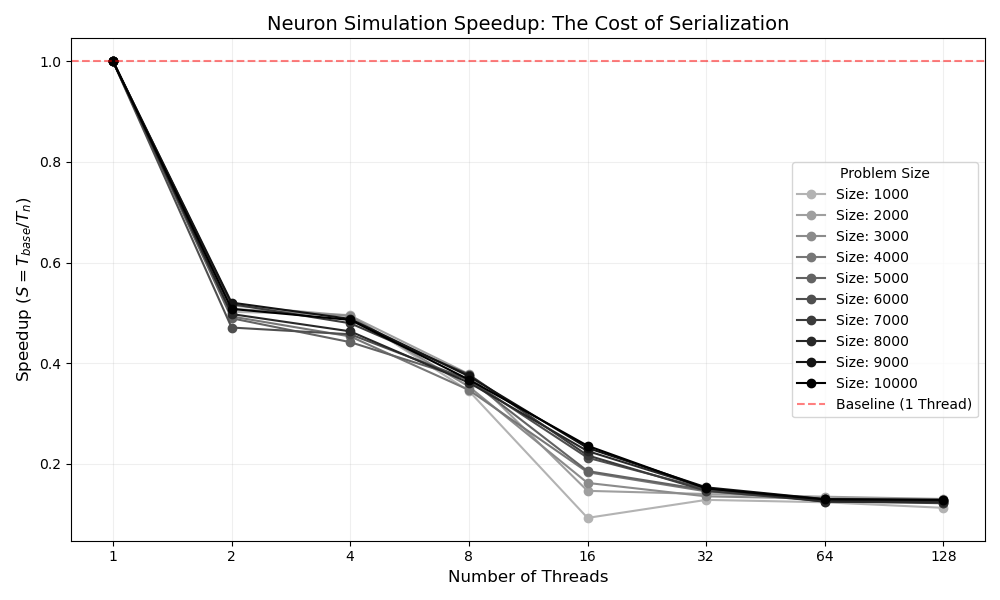

As we can see th speedup is the same for all the sizes of the neurons. That would mean that the overhead for creating tasks and giving them away to threads is much bigger than the compute time of the neuron (incrementing a variable and comparing to a constant). Which would make sense. Approximatelly 10 times as slow creating a task than doing without any tasks.

**How does varying the firing threshold affect the overall neuron activity?**


The speedup is similar. We tested having the threshold from 10 to 100. In hypothesis, having a higher threshold would only decrease the number of times it fires, hence the number of times we would enter that branch. It would only help with the branch prediction. And it quite did:

```bash
Testing size: 10
Running with 1 threads...
time: 0.095370 seconds threads: 1
Testing size: 20
Running with 1 threads...
time: 0.114515 seconds threads: 1
...
Testing size: 80
Running with 1 threads...
time: 0.135356 seconds threads: 1
Testing size: 90
Running with 1 threads...
time: 0.135061 seconds threads: 1
Testing size: 100
Running with 1 threads...
time: 0.129101 seconds threads: 1

```

# GPT Usage

For the bonus, every time a `printf` or `fprintf` was written, it was written with copilot (it can write more meaningfull debug and print messages, and the shortcut `ctrl + shift + p` to activate it and deactivate it is just too good when you don't have imagination.
The `plot_time-vs_threads_bonus.py` was done using gemini. It was verified by looking at the resulting plot and the input data.
For the other plots, gemini was used for debuggin and syntax.
